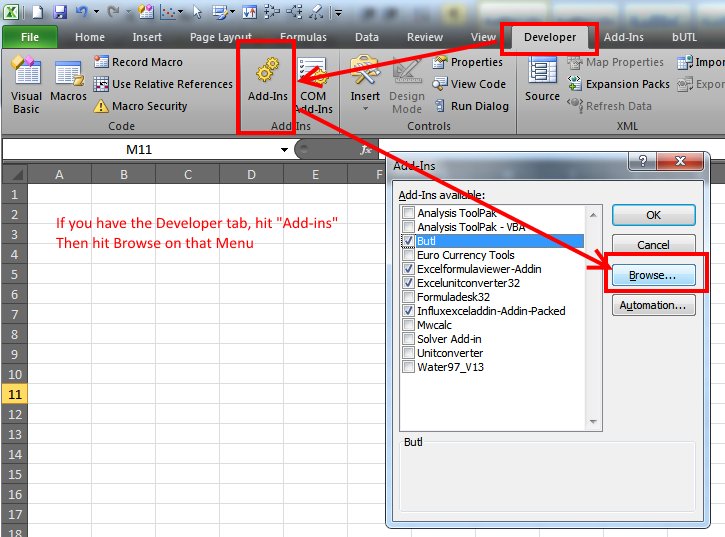
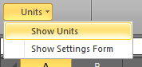
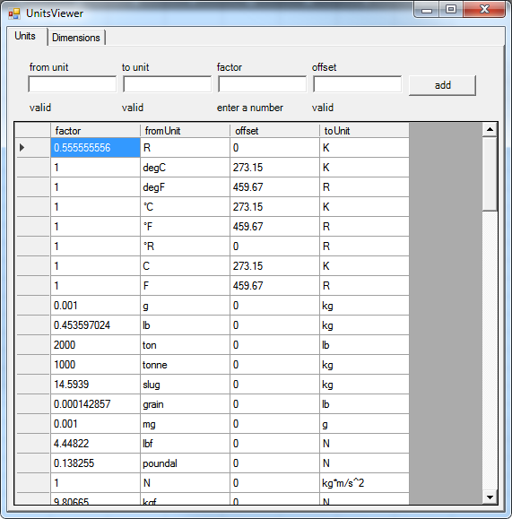
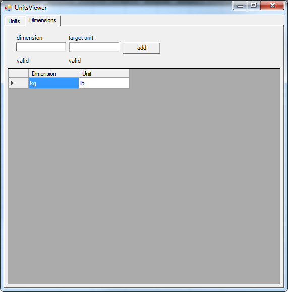

---
title: "Unit Conversion Addin"
subtitle: "Overview, installing, and summary of use"
author: [Byron Wall]
date: 2017-09-26
titlepage: true
...

# Overview of the addin
a
The Unit Conversion addin provides a simple interface for doing unit conversions within Excel.  It supports a range of units (and base dimensions).  Most importantly, the addin can infer the appropriate conversions between units as long as they extend a known unit.

# Installing the addin

\ 

# Summary of the calculation process

The main appeal of using this unit converter is that it provides a flexible means to input any unit, and it will work to find a path from the given unit down to the base SI units.  This process follows a couple of steps:

- The input text is tokenized into the unit chunks.  The rules for this process are that a unit may only include `*` and `/` as operations within it.  This explicitly does not allow a dash (`-`) to be used to indicate a unit.  It also does not allow the use of parentheses to combine units into a larger operation.
- Once the chunks are determined, the chunk pieces re then parsed to see if they contain any modifiers.  The possible modifiers are used to indicate an exponent on the unit.  An exponent can be indicated by using a caret (e.g. `ft^2`) or by using the number directly after the unit (e.g. `ft2`).  There is no difference in how these are interpreted. Note that an exponent must be an integer.
- Those chunks with their exponents are then checked to see if they are an SI unit.  If the given unit is an SI unit, then the process is complete.
- If the given unit was not an SI unit, then an iterative process is started to determine how to obtain an SI unit from the given unit.  The `to unit` is followed for the given unit to determine the conversion that takes place.  If the `to unit` is a base unit, then the process is done.  If not, the process is repeated for that unit definition until a base unit is reached or an invalid unit is reached.

After that process is run through, the final result is cached to improve future performance.  In general, the conversion is very quick without the caching.  Tests were done with >50,000 cells containing conversions, and Excel updated nearly instantaneously.

The final caveat regards how the offset is taken into account when using units that contain an offset (e.g. temperature and gauge pressure).  The offset is only applied for the final conversion.  This has an effect if you attempt to use an offset containing unit as a part of a compound unit (e.g. `°F/ft`).  When the conversion is applied in that example (e.g. to reach `K/m`), the offset will not be applied; only the `factor` portion of the unit definition is applied.  This is because the compound unit does not have a good way to consider the offset.  If however the final result is `psia` or `psig` (i.e. a single, non-compound, unit), then the offset will be considered.  If you only want the `factor` to be applied for temperature units, you should define a new unit (like `deltaK` or `deltaF`) which does define an offset.  These `delta` units are not currently defined.  For pressure however, there is the `psi` which does not consider an offset; the `psig` definition is defined to be equal to `psia` with an offset of `14.69`.  In general, all of the pressure units are defined without offsets except for the `psig` and `barg` which have offsets.

# Summary of UDFs provided by addin

The addin provides for the following functions:

|   function   |                              description                              |
| ------------ | --------------------------------------------------------------------- |
| `Conv`       | converts a given value from one unit to another                       |
| `ConvFactor` | returns the multiplicative factor to convert from one unit to another |
| `ConvToSi`   | converts a given value from one unit to the base SI unit              |
| `ConvToPref` | converts a given value in one unit to a preferred unit                |
| `UnitType`   | returns the SI unit for a given unit                                  |

All of the functions below work with either the unit given as a string (i.e. `"kg/s"`) or given as a reference to another cell.  This makes it possible to create a spreadsheet that automatically updates as the units are changed.

All of the functions are dependent on a correct unit being specified.  In general, there are two common situations which cause an error:

1. The starting unit or the desired unit are not found in the database.
1. The starting unit and desired unit exist but they do not share a common dimension

For the former issue, it is possible to define new units to the database.  These are covered below.  (TODO: add link).  If the issue is inconsistent unit types, you should use `UnitType` to determine how a given unit was interpretted.

## Conv(Value, UnitFrom, UnitTo)

The `Conv` function is used to perform a unit conversion, returning the new value after conversion.

The parameters of this function are:

| parameter |  type  |                description                 |
| --------- | ------ | ------------------------------------------ |
| value     | number | the value in the base unit to be converted |
| unit from | string | the text for the base unit                 |
| unit to   | string | the text for the desired outcome unit      |

If the unit conversion is valid, this UDF will return a single value which represents the converted value.

## ConvFactor(UnitFrom, UnitTo)

The `ConvFactor` function will return the conversion factor that should be multiplied by the base value to arrive at the desired unit.  Note that the conversion factor will only return the multiplicative factor.  This factor is not completely valid for some types of units where the conversion is defined with an offset (e.g. temperature and gauge pressure).  The factor is valid for the non-offset part of the conversion.

The parameters of this function are:

| parameter |  type  |                description                 |
| --------- | ------ | ------------------------------------------ |
| value     | number | the value in the base unit to be converted |
| unit from | string | the text for the base unit                 |

If the unit conversion is valid, this UDF will return a single value which represents the conversion factor.

## ConvToSi(Value, UnitFrom)

The `ConvToSi` function is a helper function which will convert a given value in a base unit to a new value with SI units.  This function can return the SI units along with the value if entered as an array formula.

The parameters of this function are:

| parameter |  type  |                description                 |
| --------- | ------ | ------------------------------------------ |
| value     | number | the value in the base unit to be converted |
| unit from | string | the text for the base unit                 |

If the unit conversion is valid, this UDF will return an array which includes the new value along with the text for the new SI unit.  If the formula is not entered as an array, the returned value will only include the converted value.  If you know the underlying SI units, then this is fine.  More likely, you may not exactly know the SI units, and this UDF will return those if entered as an array.  The UDF expects to output to 2 cells that are 1x2 (rows x columns).

## ConvToPref(Value, UnitFrom)

The `ConvToPref` function is a helper function which will convert a given value in a base unit to a new value using a "preferred" unit if setup, SI otherwise.  This function will return the preferred unit along with the value if entered as an array formula.

The preferred units are controlled by an interface available from the `Addins` tab on the Ribbon.

The parameters of this function are:

| parameter |  type  |        description         |
| --------- | ------ | -------------------------- |
| value     | number | the value to be converted  |
| unit from | string | the text for the base unit |

If the unit conversion is valid, this UDF will return an array which includes the new value along with the text for the unit.  If the formula is not entered as an array, the returned value will only include the converted value.  If you know the underlying unit, then this is fine.  More likely, you may not exactly know the unit, and this UDF will return those if entered as an array.  The UDF expects to output to 2 cells that are 1x2 (rows x columns).

## UnitType(UnitFrom)

The `UnitType` function is used to determine how the addin interpreted a given input.  It will show the SI unit that was determined for the given input.

The parameters of this function are:

| parameter |  type  |        description         |
| --------- | ------ | -------------------------- |
| unit from | string | the text for the base unit |

If the unit is valid, this UDF will return a single value which contains the SI unit.

# Summary of the forms for controlling the addin

There are 2 forms which can be used to control the addin.  Those forms are accessible from the `Add-Ins` tab in the Excel Ribbon.  In particular, they are located in the `Units` menu.

\ 

From that menu, the two options available are:

- `Show Units` which will give an interface to control the unit database along with the preferred units
- `Show Settings Form` which will give an interface to control the location of the units database.

## `Show Units` Form

The `Show Units` form is available to control the unit database.

### Controlling units

The first screen available shows the full definition for the units available.  It also includes a section at the top to add a new unit.

Note that behind the scenes, the units are stored in a SQLite database.  This is a flexible storage format that can also be editing using a tool other than the addin itself.

The definition of a unit consists of:

| parameter |                 description                  |
| --------- | -------------------------------------------- |
| factor    | multiplicative factor which converts         |
| from unit | the new unit                                 |
| offset    | a constant to be added at the end of factors |
| to unit   | an existing or base unit                     |

The addin has an understanding of the following base units.  These are defined in the SQLite database, but are not visible from within the addin.  You can add to the database if you want.  The currently defined base units are:

- meter (m)
- kilogram (kg)
- second (s)
- mole (mol)
- temperature (K)
- money ($)

When adding a unit, the only rule is that the `to unit` must eventually be able to reach one of these base units.  This means that your new unit needs to be able to reach an existing unit or one of these base units.  This is typically much easier than it seems. For example, if you wanted to add a mega-gram (`Mg`), you simply need to define a conversion one of the existing mass units (e.g. `g`, `kg`, `mg`, `lb`, etc.) and the addin will figure out how to get from there to any other mass unit.

Note also that the units are case sensitive.  This is required in order to differentiate between units like `Mbar` and `mbar` where the case matters.

When a change is made by adding a unit or by modifying one of the existing definitions, the spreadsheet is automatically recalculated to take affect.

### Controlling preferred units

The preferred units feature was added near the end of development.  It allows for specifying a desired output unit for all conversions which could end up as that type.  This may or may not be useful.  In any case, you can define the preferred units on the second tab.

# Summary of how the addin was built

The Unit Conversion addin was built using C#/.Net and leverages the ExcelDna library.  ExcelDna provides the framework for using C# code from within Excel.

If you want to make changes to the addin, you will need to follow a simple process:

- Modify the code using Visual Studio
- Build (compile) the addin using Visual Studio
- If you want to test the addin, Visual Studio will automatically open Excel and ask to use the new addin.  If you are doing this, you should disable any other version of the addin you may have installed.
- If you to release a new version of the addin, you should follow the build process by running `create addin.bat` which will copy the necessary files and pack the addin into a working `.xll` file.

If you want to learn more about developing an ExcelDna addin, check out the documentation for that package.  It is open source and the maintainer is quite responsive if you have any questions.
